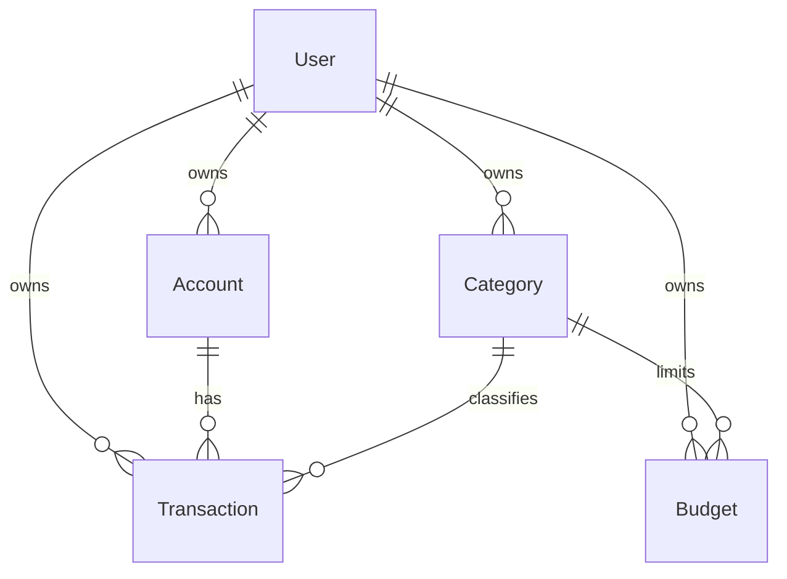
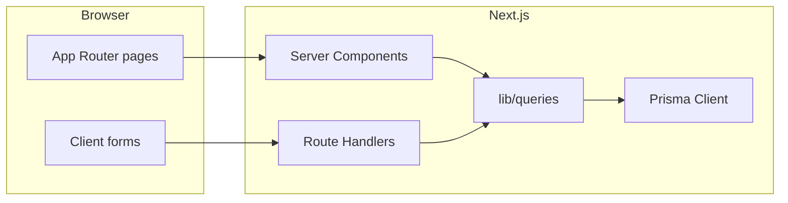

# Personal Finance Dashboard — Design Document

This document maps v1 of a multi-user personal finance dashboard: product scope, Next.js App Router project structure, Prisma/SQLite schema, REST API endpoints, pages, and data-flow conventions.

No application code is implied by this file. It is the source of truth for a later implementation.

---

## 1. Product and stack

### 1.1 What v1 does

A logged-in user can:

- See a home dashboard: account balances (net-worth style summary), income vs expense for a period, spend by category, budget vs actual, and recent transactions.
- Manage accounts (checking, savings, credit, cash).
- Manage income and expense categories.
- Record, edit, and delete transactions (including transfers between accounts).
- Set monthly per-category spending limits and compare them to actuals.

Every finance row is owned by a `User`. Users never see another user’s data.

### 1.2 Stack

| Layer | Choice |
| --- | --- |
| Runtime / UI | **Next.js App Router** (JavaScript). “Node.js (app router)” means Next.js, not a separate Express server. React Server Components for pages; Route Handlers (`app/api/**/route.js`) for the JSON API. |
| Styling | Tailwind CSS |
| ORM / DB | Prisma + **SQLite** (`provider = "sqlite"`, `url = "file:./dev.db"`) |
| Auth | Email + password. Passwords hashed with bcrypt. Session = JWT in an **httpOnly** cookie, scoped to `User`. |

### 1.3 Auth rules

- Register / login set the session cookie; logout clears it.
- Dashboard pages and all finance APIs require a valid session.
- Unauthenticated API calls return `401`.
- Authorization is always `WHERE userId = session.userId` (no relying on client-supplied user ids).

---

## 2. Project structure

```
Finance-Tracker/
├── DESIGN.md
├── package.json
├── next.config.js
├── jsconfig.json
├── tailwind.config.js
├── postcss.config.js
├── middleware.js                 # protect dashboard + API except /api/auth/*
├── .env                          # DATABASE_URL, JWT_SECRET
├── prisma/
│   ├── schema.prisma
│   └── seed.js
├── lib/
│   ├── prisma.js                 # PrismaClient singleton
│   ├── auth.js                   # hash/verify password, register/login helpers
│   ├── session.js                # sign/verify JWT, cookie name & options
│   └── queries/                  # shared Prisma queries used by RSC and Route Handlers
│       ├── accounts.js
│       ├── categories.js
│       ├── transactions.js
│       ├── budgets.js
│       └── dashboard.js
├── components/
│   ├── layout/
│   │   ├── Sidebar.jsx
│   │   └── Header.jsx
│   ├── forms/                    # account, category, transaction, budget forms
│   └── charts/                   # income vs expense, category breakdown
├── app/
│   ├── globals.css
│   ├── layout.js
│   ├── page.js                   # redirect: session → /dashboard, else → /login
│   ├── (auth)/
│   │   ├── layout.js
│   │   ├── login/page.js
│   │   └── register/page.js
│   ├── (dashboard)/
│   │   ├── layout.js             # shell: sidebar + header; require session
│   │   ├── dashboard/page.js
│   │   ├── transactions/page.js
│   │   ├── accounts/page.js
│   │   ├── categories/page.js
│   │   └── budgets/page.js
│   └── api/
│       ├── auth/
│       │   ├── register/route.js
│       │   ├── login/route.js
│       │   ├── logout/route.js
│       │   └── me/route.js
│       ├── accounts/
│       │   ├── route.js
│       │   └── [id]/route.js
│       ├── categories/
│       │   ├── route.js
│       │   └── [id]/route.js
│       ├── transactions/
│       │   ├── route.js
│       │   └── [id]/route.js
│       ├── budgets/
│       │   ├── route.js
│       │   └── [id]/route.js
│       └── dashboard/route.js
```

`middleware.js` should allow `/login`, `/register`, `/api/auth/login`, `/api/auth/register`, and static assets. Everything else under `app/(dashboard)` and `/api/*` requires a valid session cookie.

---

## 3. Database schema

### 3.1 Entity relationships



### 3.2 Prisma schema (target)

```prisma
generator client {
  provider = "prisma-client-js"
}

datasource db {
  provider = "sqlite"
  url      = env("DATABASE_URL")
}

enum AccountType {
  CHECKING
  SAVINGS
  CREDIT
  CASH
}

enum CategoryKind {
  INCOME
  EXPENSE
}

enum TransactionType {
  INCOME
  EXPENSE
  TRANSFER
}

model User {
  id           String        @id @default(cuid())
  email        String        @unique
  passwordHash String
  name         String
  createdAt    DateTime      @default(now())
  updatedAt    DateTime      @updatedAt
  accounts     Account[]
  categories   Category[]
  transactions Transaction[]
  budgets      Budget[]
}

model Account {
  id             String        @id @default(cuid())
  userId         String
  name           String
  type           AccountType
  currency       String        @default("USD")
  openingBalance Decimal       @default(0)
  createdAt      DateTime      @default(now())
  updatedAt      DateTime      @updatedAt
  user           User          @relation(fields: [userId], references: [id], onDelete: Cascade)
  transactions   Transaction[] @relation("AccountTransactions")
  transfersIn    Transaction[] @relation("TransferTarget")

  @@index([userId])
}

model Category {
  id           String          @id @default(cuid())
  userId       String
  name         String
  kind         CategoryKind
  createdAt    DateTime        @default(now())
  updatedAt    DateTime        @updatedAt
  user         User            @relation(fields: [userId], references: [id], onDelete: Cascade)
  transactions Transaction[]
  budgets      Budget[]

  @@unique([userId, name, kind])
  @@index([userId])
}

model Transaction {
  id                String          @id @default(cuid())
  userId            String
  accountId         String
  categoryId        String?
  amount            Decimal
  type              TransactionType
  date              DateTime
  note              String?
  transferAccountId String?
  createdAt         DateTime        @default(now())
  updatedAt         DateTime        @updatedAt
  user              User            @relation(fields: [userId], references: [id], onDelete: Cascade)
  account           Account         @relation("AccountTransactions", fields: [accountId], references: [id])
  category          Category?       @relation(fields: [categoryId], references: [id])
  transferAccount   Account?        @relation("TransferTarget", fields: [transferAccountId], references: [id])

  @@index([userId, date])
  @@index([accountId])
  @@index([categoryId])
}

model Budget {
  id          String   @id @default(cuid())
  userId      String
  categoryId  String
  month       String
  limitAmount Decimal
  createdAt   DateTime @default(now())
  updatedAt   DateTime @updatedAt
  user        User     @relation(fields: [userId], references: [id], onDelete: Cascade)
  category    Category @relation(fields: [categoryId], references: [id])

  @@unique([userId, categoryId, month])
  @@index([userId, month])
}
```

`DATABASE_URL` example: `file:./dev.db` (relative to the `prisma/` directory).

SQLite does not enforce Prisma enums at the database level; Prisma still validates them in the client. If enum support is awkward during migrate, the same string values can be stored as `String` with application-level checks.

### 3.3 Field rules

| Model | Rules |
| --- | --- |
| **User** | Email unique, stored lowercase. `passwordHash` never returned by APIs. |
| **Account** | `openingBalance` is the starting amount before any transactions. Current balance is **derived**, not stored: `openingBalance + income − expense − transfers out + transfers in`. Credit accounts still use the same arithmetic; UI can label a negative balance as owed. |
| **Category** | Unique per `(userId, name, kind)`. `kind` is `INCOME` or `EXPENSE`. |
| **Transaction** | `amount` is always **positive**. Sign comes from `type`. `categoryId` required for `INCOME` / `EXPENSE`; category `kind` must match `type`. For `TRANSFER`, `categoryId` is null, `transferAccountId` is required and must differ from `accountId`; both accounts must belong to the user. |
| **Budget** | `month` is `YYYY-MM`. Only `EXPENSE` categories. Unique `(userId, categoryId, month)`. |

Deleting a **User** cascades to all related rows. Deleting an **Account** or **Category** that still has transactions is **blocked** (`409`) so history is not silently dropped. Deleting a category that only has budgets is allowed if budgets are deleted with it, or blocked until budgets are removed — v1 **blocks** if any budget or transaction references it.

### 3.4 Seed

`prisma/seed.js` should create:

- One demo user (documented email/password in README later).
- Default categories: Salary, Freelance (income); Groceries, Rent, Utilities, Transport, Dining, Other (expense).
- Two accounts: Checking, Savings (opening balances set).
- A handful of sample transactions and one month of budgets so the dashboard is not empty.

---

## 4. API endpoints

All Route Handlers speak JSON. Dates are ISO-8601. Decimals are serialized as strings (e.g. `"12.50"`) to avoid float drift.

Convention: Route Handlers are the **public API**. Shared logic lives in `lib/queries/*` so Server Components can call the same functions without HTTP. Clients (forms, charts that refetch) use `fetch` against these routes.

### 4.1 Auth

| Method | Path | Purpose |
| --- | --- | --- |
| POST | `/api/auth/register` | Create user, set session cookie |
| POST | `/api/auth/login` | Verify password, set session |
| POST | `/api/auth/logout` | Clear cookie |
| GET | `/api/auth/me` | Current user (no `passwordHash`) |

**POST `/api/auth/register`**

```json
{ "email": "ada@example.com", "password": "••••••••", "name": "Ada" }
```

- `201` `{ "id", "email", "name" }` + `Set-Cookie`
- `400` validation (email format, password min length 8, name required)
- `409` email already registered

**POST `/api/auth/login`**

```json
{ "email": "ada@example.com", "password": "••••••••" }
```

- `200` `{ "id", "email", "name" }` + `Set-Cookie`
- `401` invalid credentials (same message for unknown email and bad password)

**POST `/api/auth/logout`**

- `204` empty body, cookie cleared

**GET `/api/auth/me`**

- `200` `{ "id", "email", "name" }`
- `401` if no/invalid session

### 4.2 Accounts

| Method | Path | Purpose |
| --- | --- | --- |
| GET | `/api/accounts` | List current user’s accounts (include computed `balance`) |
| POST | `/api/accounts` | Create |
| GET | `/api/accounts/[id]` | One account + `balance` |
| PATCH | `/api/accounts/[id]` | Update name, type, currency, openingBalance |
| DELETE | `/api/accounts/[id]` | Delete if unused |

**POST body**

```json
{ "name": "Checking", "type": "CHECKING", "currency": "USD", "openingBalance": "1000.00" }
```

- `404` if id is not owned by the session user
- `409` DELETE when transactions still reference the account

### 4.3 Categories

| Method | Path | Purpose |
| --- | --- | --- |
| GET | `/api/categories` | List (`?kind=INCOME` or `EXPENSE` optional) |
| POST | `/api/categories` | Create |
| PATCH | `/api/categories/[id]` | Update name / kind |
| DELETE | `/api/categories/[id]` | Delete if unused |

**POST body**

```json
{ "name": "Groceries", "kind": "EXPENSE" }
```

- `409` unique `(userId, name, kind)` conflict, or DELETE when transactions/budgets still reference the category
- Changing `kind` is rejected (`400`) if existing transactions would no longer match

### 4.4 Transactions

| Method | Path | Purpose |
| --- | --- | --- |
| GET | `/api/transactions` | List, newest first |
| POST | `/api/transactions` | Create |
| GET | `/api/transactions/[id]` | One transaction |
| PATCH | `/api/transactions/[id]` | Update |
| DELETE | `/api/transactions/[id]` | Delete |

**GET query params:** `from`, `to` (ISO dates), `accountId`, `categoryId`, optional `type`.

**POST body (income/expense)**

```json
{
  "accountId": "…",
  "categoryId": "…",
  "amount": "42.00",
  "type": "EXPENSE",
  "date": "2026-10-06",
  "note": "Weekly shop"
}
```

**POST body (transfer)**

```json
{
  "accountId": "…",
  "transferAccountId": "…",
  "amount": "200.00",
  "type": "TRANSFER",
  "date": "2026-10-06",
  "note": "To savings"
}
```

Validation:

- `amount` > 0
- `accountId` (and `transferAccountId` if present) belong to the user
- `INCOME` / `EXPENSE`: `categoryId` required; category `kind` must equal `type`
- `TRANSFER`: `transferAccountId` required, ≠ `accountId`; `categoryId` omitted/null

### 4.5 Budgets

| Method | Path | Purpose |
| --- | --- | --- |
| GET | `/api/budgets` | List for a month (`?month=2026-10` required) |
| POST | `/api/budgets` | Upsert by `(categoryId, month)` |
| PATCH | `/api/budgets/[id]` | Update `limitAmount` |
| DELETE | `/api/budgets/[id]` | Delete |

**POST body**

```json
{ "categoryId": "…", "month": "2026-10", "limitAmount": "400.00" }
```

- Category must be `EXPENSE` and owned by the user
- `month` must match `YYYY-MM`
- POST is **upsert**: create or update the unique `(userId, categoryId, month)` row
- GET includes `spent` (sum of that category’s `EXPENSE` transactions in the month) and `remaining`

### 4.6 Dashboard

| Method | Path | Purpose |
| --- | --- | --- |
| GET | `/api/dashboard` | Aggregates for the UI |

**GET query:** `from`, `to` optional (default: current calendar month).

**200 body (shape)**

```json
{
  "period": { "from": "2026-10-01", "to": "2026-10-31" },
  "accounts": [{ "id": "…", "name": "Checking", "type": "CHECKING", "balance": "1234.56" }],
  "totals": {
    "income": "3000.00",
    "expense": "1200.00",
    "net": "1800.00"
  },
  "byCategory": [{ "categoryId": "…", "name": "Groceries", "kind": "EXPENSE", "amount": "210.00" }],
  "budgets": [{ "id": "…", "categoryId": "…", "name": "Groceries", "limitAmount": "400.00", "spent": "210.00", "remaining": "190.00" }],
  "recentTransactions": []
}
```

`totals` and `byCategory` ignore transfers (transfers move money between accounts; they are not income or expense). Account `balance` includes transfers.

### 4.7 Shared error shape

```json
{ "error": "Human-readable message" }
```

| Status | When |
| --- | --- |
| 400 | Validation |
| 401 | Missing/invalid session |
| 404 | Resource not found or not owned |
| 409 | Unique constraint or delete blocked by references |

---

## 5. Pages and data flow

### 5.1 UI routes

| Path | Page | Primary APIs |
| --- | --- | --- |
| `/` | Redirect | Session check |
| `/login` | Sign in | `POST /api/auth/login` |
| `/register` | Sign up | `POST /api/auth/register` |
| `/dashboard` | Home: balances, income/expense, categories, budgets, recent txs | `GET /api/dashboard` |
| `/transactions` | Filterable list + create/edit | `GET/POST /api/transactions`, `PATCH/DELETE /api/transactions/[id]`; also accounts & categories for filters/forms |
| `/accounts` | List + create/edit | `/api/accounts` |
| `/categories` | List + create/edit | `/api/categories` |
| `/budgets` | Month picker + limits vs spent | `/api/budgets?month=` |

### 5.2 Data-flow convention



- **Reads on first paint:** dashboard layout and list pages use Server Components that call `lib/queries/*` with the session `userId` (no extra HTTP hop).
- **Mutations and refetches:** client components `fetch` the Route Handlers so the API table stays the contract for forms and future clients.
- Route Handlers authenticate via the session cookie, then call the same `lib/queries/*` functions. They do not duplicate Prisma logic.

---

## 6. Out of scope (v1)

The following are explicitly **not** in v1:

- Bank / Plaid (or similar) sync
- CSV / statement import
- Investments, net-worth assets beyond cash accounts
- Multi-currency conversion (accounts may store a `currency` code; amounts are not converted)
- Email verification, password reset, OAuth
- Recurring transactions and scheduled bills
- Sharing a household budget across users
- Mobile native apps

---

## 7. Implementation notes (when building later)

1. Create the Next.js app with JavaScript, Tailwind, and the App Router.
2. Add Prisma, point `DATABASE_URL` at SQLite, apply the schema, run seed.
3. Implement `lib/session.js` and `middleware.js` before any finance routes.
4. Ship APIs in order: auth → accounts → categories → transactions → budgets → dashboard.
5. Then wire pages and Tailwind UI to those endpoints.
